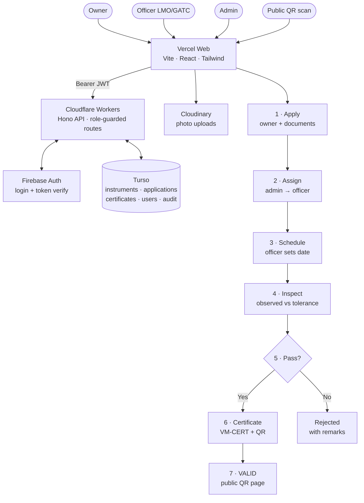

# VerifyMet — Technical Workflow (ONE slide)

Render at mermaid.live, screenshot into your PPT.

Say: "Four actors use one web app; every call carries a Firebase token
that Workers verifies before touching Turso; photos go to Cloudinary;
the instrument flows Apply → Assign → Schedule → Inspect → Certificate
→ QR, with every step audit-logged."
