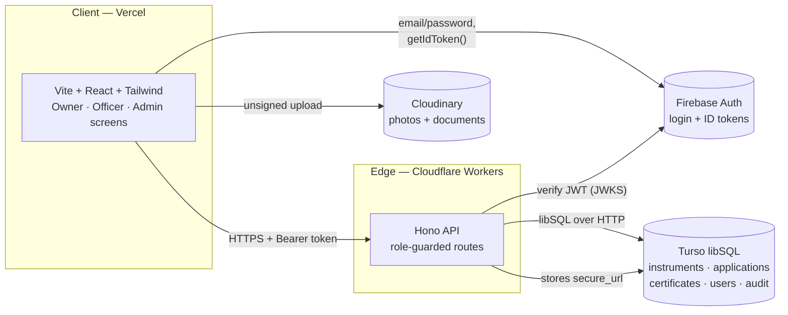
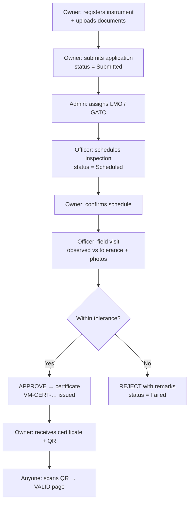
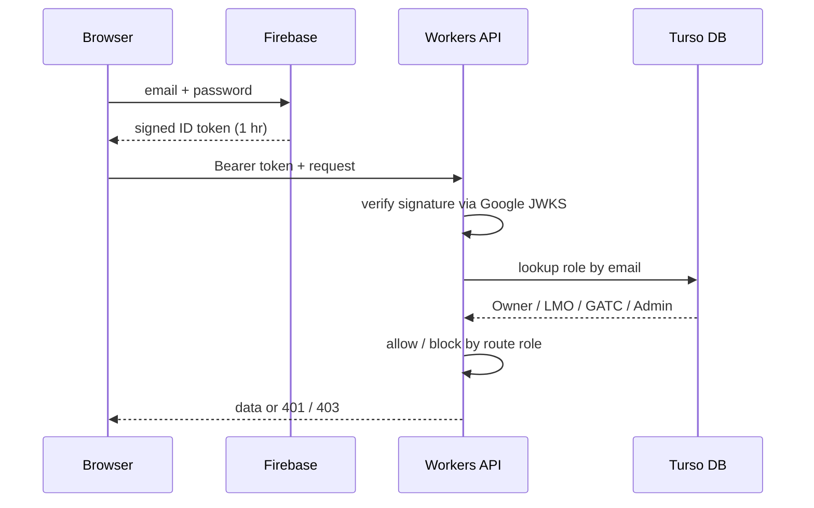
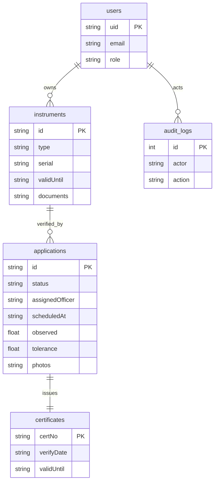

# VerifyMet — Technical Workflow (PPT-ready)

Paste the Mermaid blocks into mermaid.live (or any Mermaid PPT plugin) to
render clean diagrams for your slides. One diagram per slide.

---

## Slide 1 — System Architecture

Say: "Three managed services, zero servers to maintain. The browser talks
to Workers; Workers trusts only Google-signed tokens; all state sits in
Turso."

---

## Slide 2 — Verification Workflow (the core journey)

Say: "One instrument, six steps, every transition recorded. This is the
slide that maps 1:1 to our live demo."

---

## Slide 3 — Auth & Role Enforcement

Say: "Passwords never touch our servers. Every API call re-verifies who
you are and what you're allowed to do — officers see only their queue,
admin pages reject everyone else, QR checks stay public."

---

## Slide 4 — Data Model (5 tables)

Say: "Five tables cover the whole lifecycle — plus an audit log, so every
state change is traceable to a person and a timestamp."

---

## Slide 5 — Demo Script (60 seconds, live)

1. Register as owner → add instrument → apply (Submitted).
2. Login as admin → assign to LMO.
3. Login as LMO → schedule → record 500 vs 0.5 → Approve.
4. Back as owner → certificate + QR → scan → VALID.

Say: "Apply, schedule, inspect, verify, certify, track — all live, all on
the links in the guide."
